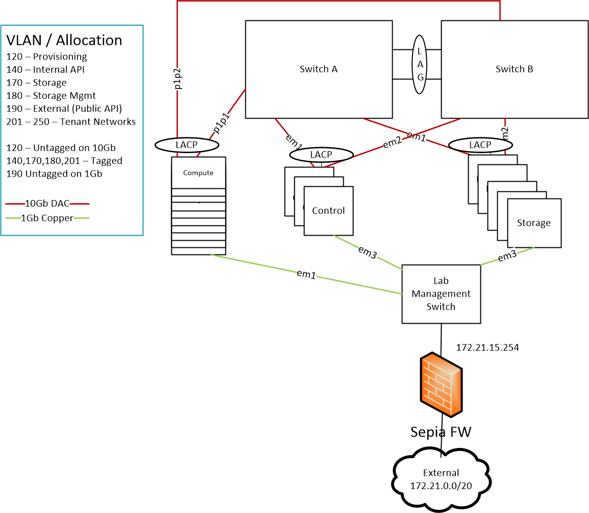

# sepialab-osp9
Scripts and OpenStack TripleO Heat Templates from Red Hat Sepia Lab.  3 Controllers, 14 Computes.

## Author
Dave Cain

## Network Diagram

## Usage Outline
1. Clone this repo `git clone https://github.com/novacain1/rhosp-templates/SEPIA/OSP9` and move all files into the `/home/stack` directory.
2. Clone the `ceph-ansible` repository and move all files into the `/home/stack/postdeploy-automation/ceph-ansible` directory.
3. Use `~/predeploy-scripts/ansible-diff-apply.sh` to create custom Jira files for Ansible.
4. Install Red Hat OSP-Director using provided `undercloud.conf`.  Modify if necessary.
5. Import and Introspect hardware with provided `~/sepia.json` to force static assignment of nodes to specific hardware profiles.
6. Use `~/customize_overcloudimage.sh` to modify the stock OSP9 overcloud image removing Red Hat Ceph Storage 1.3 and installing Red Hat Ceph Storage 2.0.
7. Modify `~/templates` to suit your respective environment:
   * Update `network-environment.yaml` and `nic-configs/*` for your respective network configuration in your environment.  Very important!
   * Update `refarch.yaml` for generic Hiera and parameter overrides (including bridge configuration) that should be customized in your respective environment.  There are some Red Hat Ceph Storage parameters in here that must match what you will lay down with `ceph-ansible`.
   * Update `environments/puppet-ceph-external.yaml` for your *planned* Red Hat Ceph deployment using Ansible.
   * Update `nic-mappings.yaml` should you need to specifically force mac address assignment on nodes to adhere to the abstracted NIC naming logic present in os-net-config and used by OSPd (nic1, nic2, nic3, etc).  If you do not need this ability, remove the `-e` from the `deployOSP.sh` script.
   * Update `ips-from-pool-all.yaml` should you need to statically assign ipv4 addresses on networks to have the same assignment each deployment.  If you do not need this ability, remove the `-e` from the `deployOSP.sh` script.
   * *Be aware that `post-allnodes.yaml` wipes all non-root disks presented to the Director node in preparation to use them as Red Hat Ceph Storage OSDs and Journals.  Don't use systems with data on them that you care about, else it will be lost!*
8. Deploy Red Hat OpenStack Platform with `deployOSP.sh` after sourcing the `stackrc` file as the `stack` user.
9. Deploy Red Hat Ceph Storage 2.0 with Ansible via `ansible-playbook -i ~/postdeploy-automation/hosts site.yml'`.
10. Enable Fencing on the Controller nodes via `./~/postdeploy-automation/agent_fencing.sh root calvin enable`.
11. Use the `~/postdeploy-automation/postdeploy.sh` to do the following:
   * Add external repos for package installation.
   * Restart necessary OpenStack services after RHCS 2.0 is installed via `ceph-ansible`.
   * Toggle standalone vs a converged RHCS Ceph deployment.
   * Install a user, tenant, security groups, keypair, network, router, and floating IP network to begin testing the new Overcloud.
   

## Branches
Choose a branch that suits what you're trying to deploy.  Multiple branches will be added with the release of OSP10.

## Disclaimer
I work for Red Hat but this repo _by itself_ is not officially supported.
